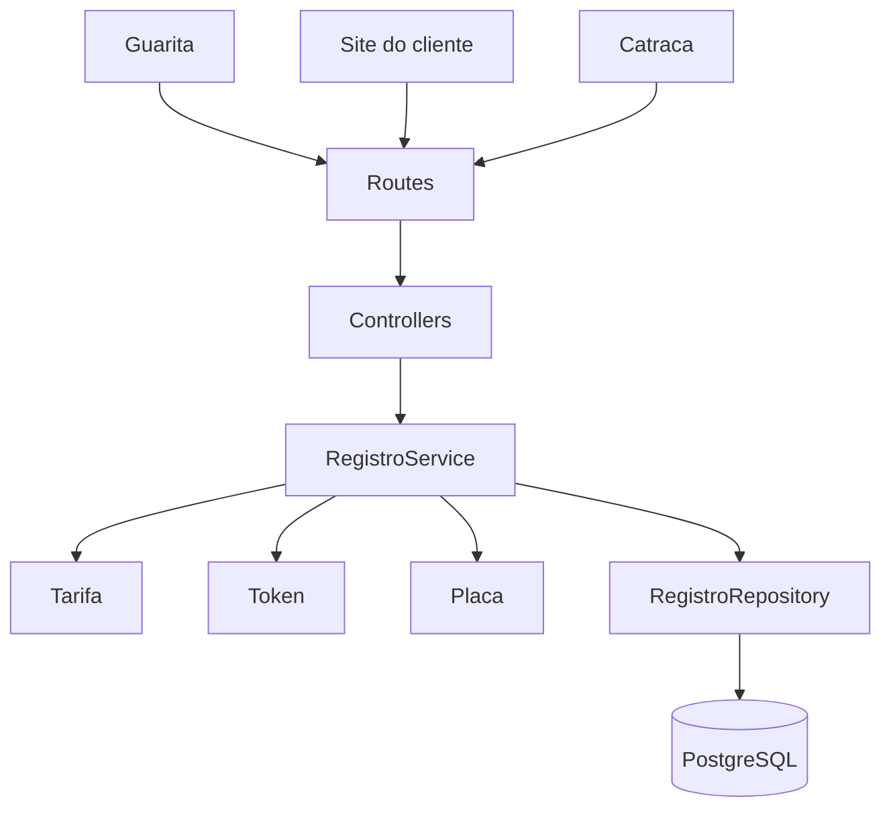

# Backend API — Design

**Spec**: `backend/.specs/features/backend-api/spec.md`
**Status**: Approved

---

## Architecture Overview

API Express em camadas sobre o `RegistroRepository` já existente. Regras de token, tarifa, janela de 10 minutos e multa de 15% ficam no service. Persistência continua no PostgreSQL via `pg`.



---

## Code Reuse Analysis

### Existing Components to Leverage

| Component | Location | How to Use |
| --------- | -------- | ---------- |
| Pool PostgreSQL | `backend/src/db/pool.ts` | Health check e injeção no repositório |
| RegistroRepository | `backend/src/repositories/registro.repository.ts` | Estender para token, motorista e estados de pagamento |
| Types | `backend/src/types/registro.ts` | Ampliar campos e códigos de erro |
| Schema Docker | `database/init.sql` | Incluir token, status extras e colunas de pagamento |
| AD-004 / AD-005 | `.specs/STATE.md` | Tarifa R$ 5/h e validação de placa |

### Integration Points

| System | Integration Method |
| ------ | ------------------ |
| Frontend guarita / cliente | REST JSON em `/api/*`, CORS `localhost:5173` |
| Catraca simulada | `POST /api/saida` com `{ token }` |
| PostgreSQL | `DATABASE_URL` |

---

## Components

### Domain rules

- **Purpose**: Validar placa, gerar token, calcular tarifa e multa.
- **Location**: `backend/src/domain/regras.ts`
- **Interfaces**:
  - `normalizarPlaca(placa: string): string`
  - `validarPlaca(placa: string): boolean`
  - `gerarToken(): string`
  - `validarToken(token: string): boolean`
  - `calcularValor(entradaEm: Date, saidaEm: Date): number`
  - `calcularMulta(valorCobrado: number): number`
  - `janelaSaidaExpirada(pagoEm: Date, agora: Date): boolean`
- **Dependencies**: none
- **Reuses**: regex de placa do design anterior

### RegistroRepository

- **Purpose**: Persistir transições de estado.
- **Location**: `backend/src/repositories/registro.repository.ts`
- **Interfaces**:
  - `registrarEntrada(dados): Promise<Registro>`
  - `buscarPorToken(token): Promise<Registro | null>`
  - `marcarPago(id, valor, pagoEm): Promise<Registro>`
  - `marcarMultaPendente(id, valorMulta): Promise<Registro>`
  - `marcarMultaPaga(id, pagoEm): Promise<Registro>`
  - `finalizarSaida(id, saidaEm): Promise<Registro>`
  - `listarNoPatio(): Promise<Registro[]>`
  - `historicoPorPlaca(placa): Promise<Registro[]>`
- **Dependencies**: `pg` pool
- **Reuses**: mapeamento de row e `RepositoryError`

### RegistroService

- **Purpose**: Orquestrar cadastro, login, pagamento, multa e saída.
- **Location**: `backend/src/services/registro.service.ts`
- **Dependencies**: repository + domain rules + `FRONTEND_URL`
- **Reuses**: códigos de erro do repositório

### HTTP

- **Purpose**: Rotas REST e erros padronizados.
- **Location**: `backend/src/app.ts`
- **Dependencies**: Express, CORS, Zod, RegistroService

---

## Data Models

### Registro

```typescript
type StatusRegistro = 'ativo' | 'pago' | 'multa_pendente' | 'finalizado';

interface Registro {
  id: string;
  placa: string;
  token: string;
  motoristaNome: string;
  modelo: string | null;
  cor: string | null;
  entradaEm: Date;
  saidaEm: Date | null;
  pagoEm: Date | null;
  valorCobrado: number | null;
  valorMulta: number | null;
  multaPagaEm: Date | null;
  status: StatusRegistro;
  criadoEm: Date;
}
```

### Schema SQL

Ampliar `registros_estacionamento`:

- `token VARCHAR(7) NOT NULL UNIQUE`
- `motorista_nome VARCHAR(120) NOT NULL`
- `modelo VARCHAR(60)`
- `cor VARCHAR(30)`
- `pago_em TIMESTAMPTZ`
- `valor_multa DECIMAL(10,2)`
- `multa_paga_em TIMESTAMPTZ`
- `status_registro`: `ativo | pago | multa_pendente | finalizado`
- índice único parcial: uma placa no pátio (`status <> 'finalizado'`)

Volume Docker existente precisa de `docker compose down -v` para reaplicar `init.sql`.

---

## Endpoints

| Método | Rota | Sucesso |
| ------ | ---- | ------- |
| POST | `/api/entrada` | 201 |
| GET | `/api/tickets/:token` | 200 |
| POST | `/api/tickets/:token/pagamentos` | 200 |
| POST | `/api/tickets/:token/multas` | 200 |
| POST | `/api/saida` | 200 |
| GET | `/api/ativos` | 200 |
| GET | `/api/historico/:placa` | 200 |
| GET | `/api/health` | 200 |

Erro padrão:

```json
{ "erro": "CODIGO_ERRO", "mensagem": "texto" }
```

`JANELA_SAIDA_EXPIRADA` e `MULTA_PENDENTE` incluem `valorMulta`.

---

## Error Handling Strategy

| Error Scenario | Handling | User Impact |
| -------------- | -------- | ----------- |
| Placa inválida | 400 PLACA_INVALIDA | Guarda corrige o campo |
| Token inexistente | 404 TOKEN_INVALIDO | Cliente confere o papel |
| Placa já no pátio | 409 PLACA_JA_ATIVA | Não gera segundo token |
| Janela expirada | 409 + valorMulta | Cliente paga multa no site |
| Banco down | 503 SERVICO_INDISPONIVEL | Operador sobe o Docker |

---

## Risks & Concerns

| Concern | Location | Impact | Mitigation |
| ------- | -------- | ------ | ---------- |
| Volume Postgres antigo sem colunas novas | `docker-compose.yml` volume `pgdata` | API quebra no INSERT | Documentar `down -v` no README |
| Import quebrado de `@types/pg` | `backend/src/db/pool.ts` (working tree) | Runtime falha | Manter `import pg from 'pg'` |
| Relógio em testes de janela | service de saída | Flake de 10 minutos | Injetar `clock` no service |

---

## Tech Decisions

| Decision | Choice | Rationale |
| -------- | ------ | --------- |
| Relógio | `clock(): Date` injetável no service | Testar janela de 10 min sem sleep |
| Token | `crypto.randomBytes` mapeado para `[A-Z0-9]` | Sem dependência extra |
| Validação HTTP | Zod | Já prevista no design anterior |
| Testes | Vitest + Supertest | Unitário nas regras; HTTP contra service em memória ou PG |
